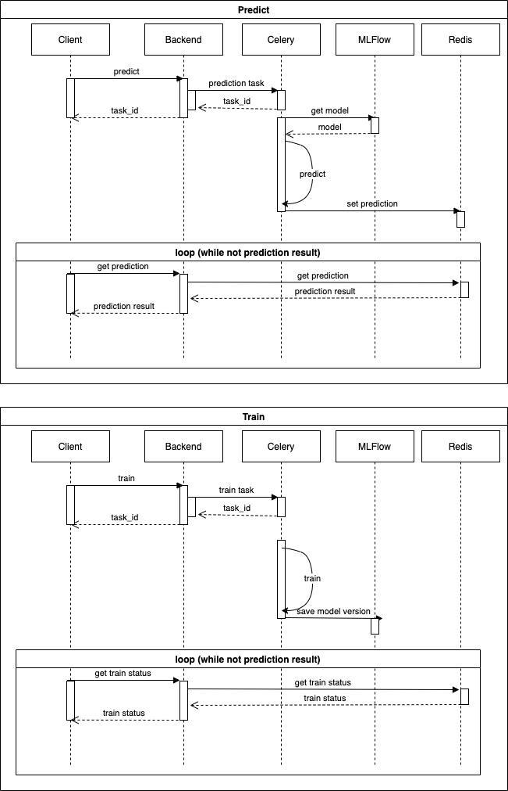

# LSML2 Final Project

This is LSTM model for lyrics generator with musician style .

Model: Embedding layer (no pretrain) + LSTM

Dataset:
```example_csv/lyrics.tgz```

Dataset has more than **2.000.000** lyrics from different artists

## Sequence diagram




### Images:
 - backend: fastapi
 - async tasks: celery
 - redis: message broker and result backend
 - lsml_postgres: database for mlflow
 - mlflow: backend server of https://mlflow.org/

### Loss function
```CrossEntropyLoss```


### Final project satisfies all the requirements:
1. Design document and dataset description
2. Model training code
- Jupyter Notebook (```train_gpu.ipynb```) I've created pretrained models for cold start
- MLFlow project (You can train your own models and store them on mlflow server)
3. Dockerfile
 - docker-compose for full architecture
 - asynchronous project
 - REST API
 - HTML Frontend (Vue.js)
 - trained from scratch


## How to start?
```docker-compose up```


### Project links
 - Fronted http://0.0.0.0/
 - REST API http://0.0.0.0/docs
 - ML FLOW Server http://0.0.0.0:5001/


#### PS
There are 3 pretrained models for `beatles`, `eminem`, `frank-sinatra` by myself on Google Coolab

You can train your own (There are several prepared csv for training `example_csv/beyonce.csv` & `example_csv/easy_e.csv`)

Just open http://0.0.0.0/add-artist and upload any .csv (`lyrics` header required)
